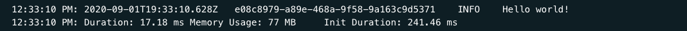
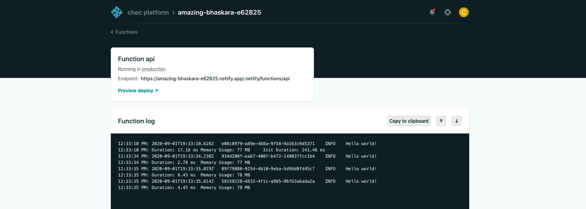
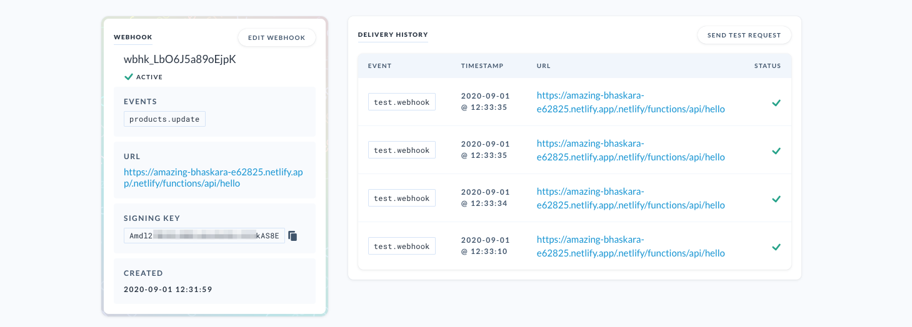

# Commerce.js "hello world" serverless function on Netlify

[](https://app.netlify.com/sites/amazing-bhaskara-e62825/deploys)



This template provides a starting point to use [Netlify](https://www.netlify.com/) serverless functions with
[Express.js](https://expressjs.com/) as a framework. You can connect your [Commerce.js](https://commercejs.com)
store to functions like this in order to extend the options for functionality on a Jamstack environment.

Some examples of things you could do:

* Print "Hello world!" to the console
* Automatically generate a discount code when a cart reaches a certain value threshold, and apply it to the cart
* Send your customers SMS messages when their orders are fulfilled
* Anything receiving Chec webhooks
* Anything requiring a secret API key

## Requirements

* Node.js
* Yarn or npm
* A Netlify account
* A Chec account

## Getting started

You may clone this repository and deploy it straight to Netlify, although it may be better if you already have a
project on Netlify to include it as part of your existing project. For this example we'll assume you're doing some
local development to start with.

This template comes with axios installed by default (although not used) in case you need to make HTTP requests.
Feel free to swap this for any other HTTP library.

### Environment variables

Set the following in your `.env` file, or use `.env.example` as a template (`cp .env.example .env`):

* `WEBHOOK_SIGNING_KEY`: The Chec webhook signing key, which is available from
  [the "Webhooks" section of the Chec Dashboard](https://dashboard.chec.io/settings/webhooks)

### Local development

Clone the repository, install dependencies, then start your Express.js server:

```
git clone git@github.com:chec/netlify-serverless-helloworld.git
cd netlify-serverless-helloworld
yarn
yarn start

...
Lambda server is listening on 9000
```

Once your server is running it will be accessible at `http://localhost:9000/.netlify/functions/hello`. This represents
your function name "hello", which is mapped from the `src/` folder. For more information on how the netlify-lambda
library works, see [the documentation here](https://github.com/netlify/netlify-lambda).

At this point you can ping your server with cURL and you should receive an error for missing environment variables:

```
curl -X POST http://localhost:9000/.netlify/functions/hello
{"message":"Environment variable WEBHOOK_SIGNING_KEY is not defined."}
```

## Configuring a Chec webhook

Serverless functions such as this example can be triggered in a number of ways, but the most common ways will be
(A) by a webhook in the Chec Platform, or (B) manually as part of your frontend checkout flow.

To test this out you may wish to use webhooks. You can set these up easily from the
[Chec Dashboard](https://dashboard.chec.io/settings/webhooks) under Developer > Webhooks. Select a common event such
as `products.update`, enter a _publicly accessible URL for your local server_ (hint: use [ngrok](https://ngrok.com) for
a local development proxy), and copy your webhook signing key into your `.env` file here. You'll need to restart your
local server to pick up the new environment variable.

Go and send a test request for your webhook, or change a product name a few times. If all goes well, you should see
the following in your server log:

```
Request from 123.45.67.89: POST /.netlify/functions/hello
Hello world!
Response with status 200 in 57 ms.
```

## Deploying to Netlify

If you haven't got a Netlify account already, you can sign up for free using your GitHub account. Head over to
[the Netlify dashboard](https://app.netlify.com/) and click "New site from Git". We will assume you are working with
a copy of this repository for the purpose of these examples, but you may also configure serverless functions in
existing projects too.

When you are asked for your "Basic build settings", you can enter the following:

* **Build command:** `yarn build`
* **Publish directory:** `dist`. Note: Netlify requires a publish directory, so projects that only use functions will
  need to create an empty file: `dist/index.html`

Click "Show advanced", and add your signing key while you're here:

* `WEBHOOK_SIGNING_KEY`: _the key copied from Chec Dashboard_

Click "Deploy site". Once your project has finished deploying, you can update your webhook configuration to point
to the new Netlify domain. This will be something like https://amazing-bhaskara-e62825.netlify.app/.netlify/functions/api/hello.

## You're done!

You can watch the function log output in the Netlify dashboard to monitor processes:



The Chec Dashboard will also show you a history of the webhook's delivery:



## Support

If you have any questions or would like support using this template, please reach out in our [community Slack channel](https://chec-commercejs-community.herokuapp.com/).

## License

This project is licensed under BSD-3-Clause. See [the license](LICENSE.md) for information.
